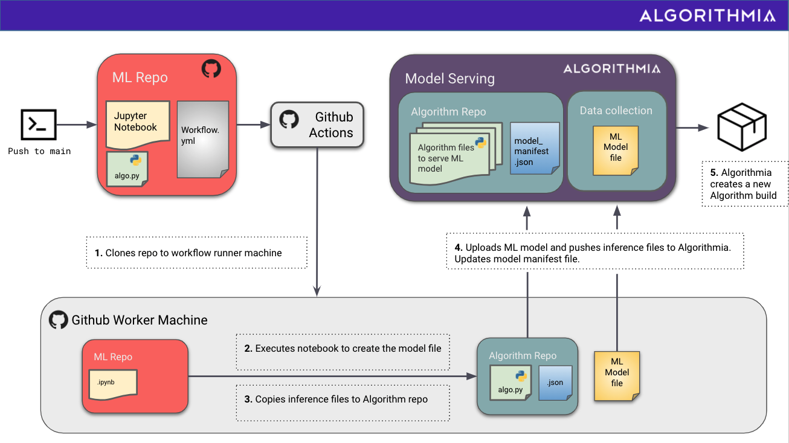
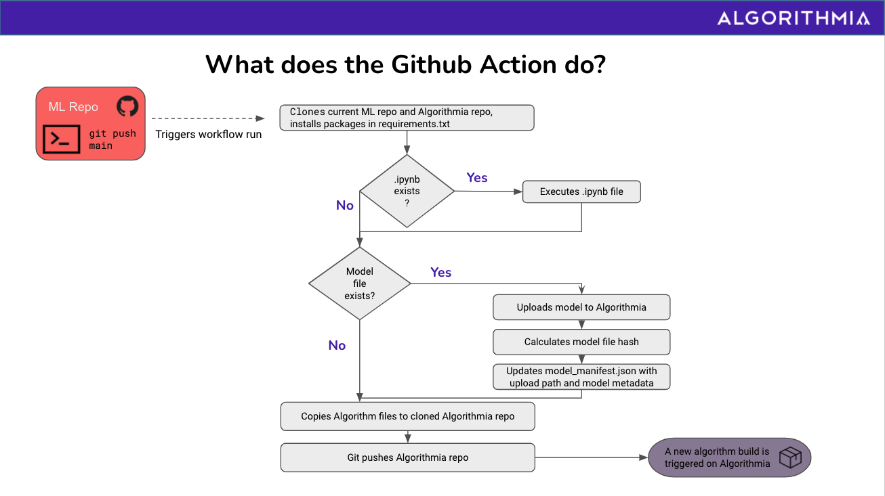
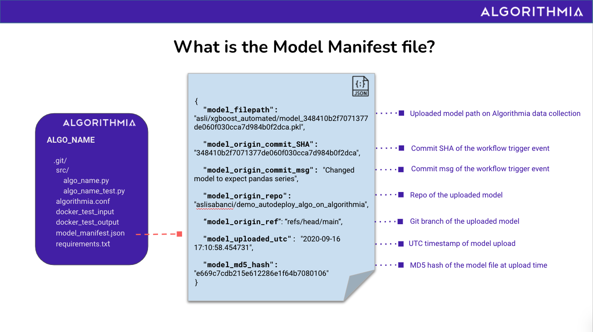

# Github Action for Continuous Deployment from an ML Repo at Github to Algorithmia

## When to use it?
After you create an algorithm on Algorithmia as the scalable inference endpoint for your ML model, you can incorporate this Github Action to your Github ML repository's workflow file, to automate deploying your model and your inference (algorithm) code.

This action would be a good fit for your workflow if you are using a Jupyter notebook to train and evaluate your ML model or checking your saved model file into your repository and you optionally prefer to work on your inference (algorithm) code in this same repository.


## How does it work?

Whenever you do a Git push to your master branch (or any other triggering event you configure), your workflow integrating this Github Action will kick off.



If you're developing your ML model in a Jupyter notebook, you can configure the workflow with the notebook path to execute. In this case, the Github Action will:
  - Install the required packages in your requirements.txt file on a Github worker machine
  - Run your configured Jupyter notebook file on the worker machine's from-scratch environment 
  
If not and if you have an already saved model checked-in to your repository, you can configure the workflow with the existing model file path.

In both scenarios, the Github Action will then:
- Take the ML model file from the configured path and upload it to your data collection at Algorithmia
- Copy your inference (algorithm) files to your algorithm repository
- Update/create a model_manifest.json file, connecting your inference (algorithm) code at Algorithmia with this newly uploaded model file



## What other perks does it have?
To get your inference endpoint use this newly uploaded model, the workflow will make the connection between your inference algorithm and the uploaded model file, with the key-value pairs in  `model_manifest.json` file.
In addition to that, the manifest file will contain certain metadata such as:
- Which Github repository and which ref was this model file uploaded from?
- What was the MD5 hash of your model file when it was first created?
- What is the Github commit SHA and the commit message resulting in this automated upload?
- When did this upload happen?

By using this manifest, your inference script will know which model to load and use. It can also re-calculate the MD5 hash of the model file at inference time and compare it with the original MD5 hash that was calculated at the time of the upload, and make sure that the model file hasn't been changed.  



## How to configure it?

The required / optional inputs to this Github Action are listed below.

Among these, some inputs are required when your Algorithmia algorithm is hosted at (backed by) Github and some will be required when your Algorithmia algorithm is hosted at (backed by) Algorithmia.

You'll also notice that some of the inputs have default values, so that you're not bogged down in configuration and can start with reasonable defaults. So make sure to check out the default values first and if you want a non-default configuration for these, you can provide those values in your own ML repo's workflow file.

```
inputs:
  algorithmia_api_key:
    description: 'Algorithmia API Key, used when uploading the model file'
    required: true
  algorithmia_username:
    description: 'Algorithmia Username, used as Git Commit Username and as part of default model upload path'
    required: true
  algorithmia_email:
    description: 'Algorithmia Email, used as Git Commit Email'
    required: false
    default: 'githubactions@placeholder.email'
  algorithmia_password:
    description: 'Algorithmia Password. Only required if the algorithm is hosted on Algorithmia.'
    required: false
  github_username:
    description: 'Github username owning the algorithm repository, used to clone the algorithm repository. Only required if the algorithm is hosted on Github.'
    required: false
  github_pat:
    description: 'Github Personal Access Token, used to clone the algorithm repository. Only required if the algorithm is hosted on Github.'
    required: false  
  algorithmia_algoname:
    description: 'Algorithmia Algorithm name'
    required: true
  algorithmia_uploadpath:
    description: 'Algorithmia data collection name to upload the model file'
    required: true
    default: 'data://$ALGORITHMIA_USERNAME/$ALGORITHMIA_ALGONAME'
  model_path:
    description: 'Path of the model file to be uploaded to Algorithmia'
    required: true
    default: 'model.pkl'  
  notebook_path:
    description: 'Path of the notebook to be executed by this action'
    required: false
    default: 'model_training.ipynb'
  git_host:
    description: Git host for the Algorithmia algorithm repository. Change to git.algorithmia.com if the algorithm is hosted on Algorithmia Marketplace or git.YOUR_DOMAIN for enterprise installations.
    required: false
    default: 'github.com'
  algorithmia_api: 
    description: API endpoint Algorithmia installation, for enterprise customers.
    required: false
    default: 'https://api.algorithmia.com'
```


## Example usages
Check out the two example ML repos that incorporate this Github Action to continuously deploy
  * [to an Algorithmia algorithm backed by Algorithmia](https://github.com/algorithmiaio/githubactions-modeldeployment-demo-algorithmiaalgo)
  * [to an Algorithmia algorithm backed by Github](https://github.com/algorithmiaio/githubactions-modeldeployment-demo-githubalgo)
 
